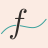

# FuncSketch

A graphing calculator currently in development.

This project aims to provide:

- real-time graphing of functions
- support for a wide range of mathematical functions,
  from basic ones like trigonometric functions to special functions such as Bessel functions.

## Installation

Currently, the project is under development and available only via building from source.
See [Build FuncSketch in Repository](docs/sphinx/build_in_repository.md) for instructions.

## Documentation

Documentation is available for:

- [Development version](https://funcsketch.musicscience37.com/)

## Repositories

- [Main repository in GitLab](https://gitlab.com/MusicScience37Projects/tools/func-sketch)
- [Mirror in GitHub](https://github.com/MusicScience37/FuncSketch)

## License

This project is licensed under the [Apache License 2.0](LICENSE.txt).

## Links for Developers

- [Coverage of C++](https://funcsketch.musicscience37.com/coverage_cpp/)
- [Coverage of Python](https://funcsketch.musicscience37.com/coverage_python/)
